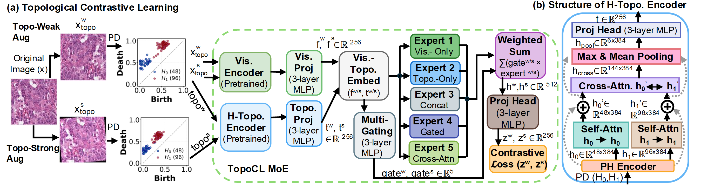
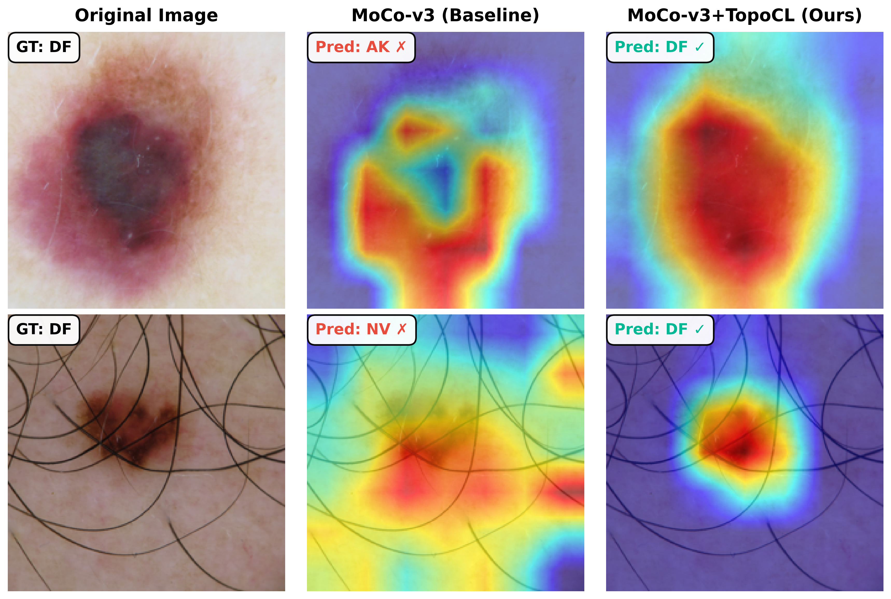
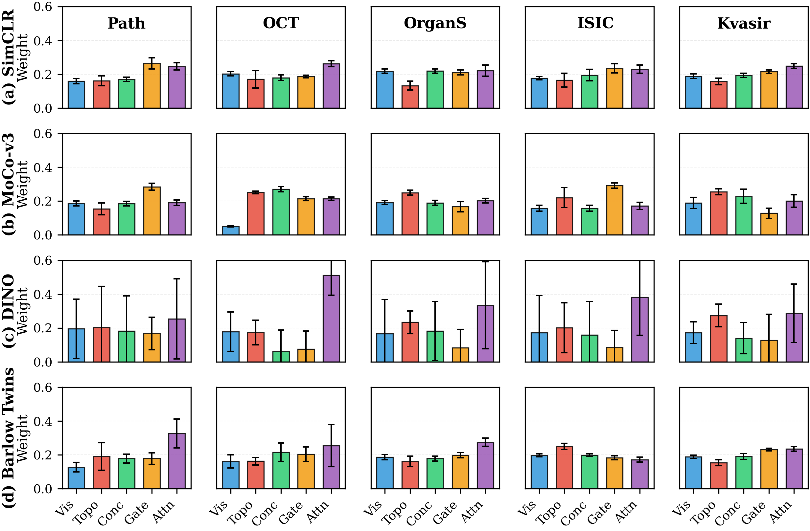

# TopoCL: Topological Contrastive Learning for Medical Image Analysis

**CVPR 2026**

TopoCL is a 3-stage pipeline that combines visual features with topological descriptors (persistent homology) through a Mixture-of-Experts fusion architecture for self-supervised medical image representation learning.

## Pipeline Overview

<p align="center">
  
</p>

1. **Stage 1 - Visual Pretraining**: Self-supervised pretraining of a ResNet-50 backbone using 5 SSL methods (SimCLR, MoCo-v3, BYOL, Barlow Twins, DINO)
2. **Stage 2 - Topology Pretraining**: Train a hierarchical topology encoder on persistent homology features extracted from medical images
3. **Stage 3 - MoE Fusion**: Joint fine-tuning combining visual and topological encoders through a 5-expert Mixture-of-Experts gating mechanism

## Installation

```bash
pip install -r requirements.txt
```

## Repository Structure

```
TopoCL/
├── topocl/                    # Core library package
│   ├── models/                # ResNet encoder, topology encoder, MoE fusion, SSL heads
│   ├── data/                  # Datasets, augmentations, persistence computation, ROI extraction
│   ├── losses/                # Contrastive loss functions
│   └── utils/                 # Training and evaluation utilities
├── scripts/                   # Training and evaluation scripts
│   ├── stage1_pretrain.py     # Unified visual encoder pretraining (5 SSL methods)
│   ├── stage2_pretrain.py     # Topology encoder pretraining
│   ├── stage3_finetune.py     # Joint MoE fine-tuning
│   └── evaluate.py            # Standalone linear probe evaluation
├── configs/                   # YAML configuration files
├── analysis/                  # Paper figure generation scripts
└── requirements.txt
```

## Quick Start

### Stage 1: Visual Encoder Pretraining

```bash
python scripts/stage1_pretrain.py --method simclr --dataset pathmnist --epochs 200
python scripts/stage1_pretrain.py --method dino --dataset isic2019 --data_dir ~/data/isic2019
```

### Stage 2: Topology Encoder Pretraining

```bash
python scripts/stage2_pretrain.py --dataset pathmnist --method supervised_ce --epochs 100
```

### Stage 3: MoE Fusion Fine-tuning

```bash
python scripts/stage3_finetune.py --dataset pathmnist --epochs 150
```

### Evaluation

```bash
python scripts/evaluate.py --dataset pathmnist --method simclr
```

## Supported Datasets

| Dataset | Modality | Classes | Train / Test |
|---------|----------|:-------:|:------------:|
| PathMNIST | Colon Pathology | 9 | 89,996 / 7,180 |
| OCTMNIST | Retinal OCT | 4 | 97,477 / 1,000 |
| OrganSMNIST | Abdominal CT (Sagittal) | 11 | 13,940 / 8,829 |
| ISIC2019 | Skin Lesion Dermoscopy | 8 | 25,331 / 8,238 |
| Kvasir | GI Endoscopy | 8 | 3,200 / 800 |

## Main Results

Performance comparison across five medical image datasets (mean +/- std over 5 runs). TopoCL consistently improves all SSL baselines.

| Method | Path ACC | Path AUC | OrganS ACC | OrganS AUC | OCT ACC | OCT AUC | ISIC ACC | ISIC AUC | Kvasir ACC | Kvasir AUC | **Avg ACC** | **Avg AUC** |
|--------|:--------:|:--------:|:----------:|:----------:|:-------:|:-------:|:--------:|:--------:|:----------:|:----------:|:-----------:|:-----------:|
| SimCLR | 92.57 | 99.12 | 77.12 | 96.41 | 69.41 | 91.83 | 66.04 | 88.01 | 74.33 | 95.89 | 75.89 | 94.25 |
| +TopoCL | **93.21** | **99.28** | **78.62** | **96.75** | **73.10** | **93.41** | **71.62** | **89.82** | **78.61** | **97.11** | **79.03** | **95.27** |
| MoCo-v3 | 93.13 | 99.07 | 78.02 | 99.57 | 80.02 | 96.01 | 74.98 | 92.86 | 88.42 | 97.37 | 82.91 | 96.98 |
| +TopoCL | **94.55** | **99.24** | **80.58** | 98.75 | **82.09** | **97.09** | **78.44** | **93.26** | **91.17** | **98.81** | **85.37** | **97.43** |
| BYOL | 93.42 | 99.31 | 76.41 | 97.33 | 76.02 | 95.89 | 73.82 | 90.75 | 85.67 | 96.91 | 81.07 | 96.04 |
| +TopoCL | **94.89** | **99.41** | **79.53** | **98.03** | **79.13** | **96.18** | **77.18** | **91.52** | **88.83** | **97.55** | **83.91** | **96.54** |
| DINO | 91.92 | 98.99 | 71.11 | 95.39 | 61.21 | 91.27 | 63.24 | 85.28 | 71.42 | 96.99 | 71.78 | 93.58 |
| +TopoCL | **94.57** | **99.38** | **77.21** | **96.96** | **65.03** | **93.87** | **67.08** | **88.38** | **77.99** | **98.31** | **76.38** | **95.38** |
| Barlow | 93.09 | 99.41 | 76.76 | 98.13 | 78.08 | 96.91 | 62.70 | 87.11 | 73.41 | 97.57 | 76.81 | 95.83 |
| +TopoCL | **94.91** | **99.52** | **79.69** | **98.75** | **80.51** | **97.28** | **67.22** | **89.02** | **78.08** | **98.13** | **80.08** | **96.54** |

### Qualitative Results

**Figure 1: Grad-CAM comparison** -- Baseline (left) vs TopoCL (right) on ISIC2019 failure cases. TopoCL focuses on clinically relevant regions.

<p align="center">
  
</p>

**Figure 3: Expert Gating Weights** -- Adaptive MoE gating across datasets and methods.

<p align="center">
  
</p>

## Key Architecture Details

- **Topology Encoder**: Hierarchical encoder with separate H0/H1 processing, cross-homology attention (hidden_dim=384, 4 heads)
- **MoE Fusion**: 5 experts (Visual-only, Topology-only, Concatenation, Cross-Attention, Gated Fusion) with meta-gating
- **Persistence Features**: Multi-scale (1.0, 0.5, 0.25) persistent homology with n_h0=48, n_h1=96 per scale

## Citation

```bibtex
@inproceedings{topocl2026,
  title={TopoCL: Topological Contrastive Learning for Medical Image Analysis},
  author={},
  booktitle={CVPR},
  year={2026}
}
```
